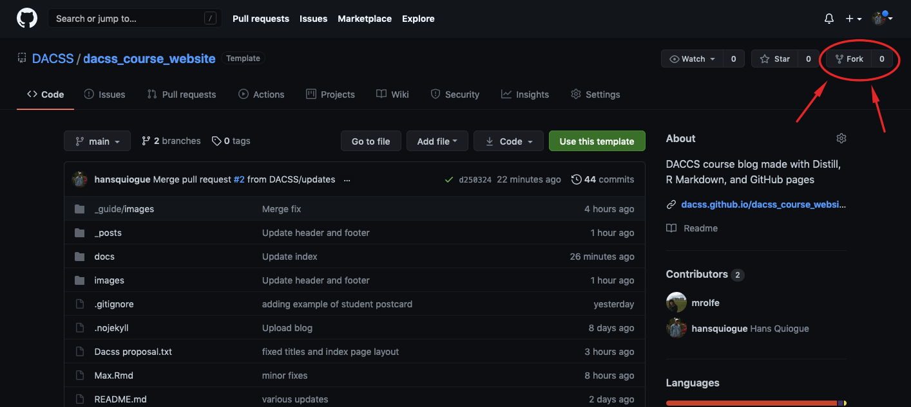
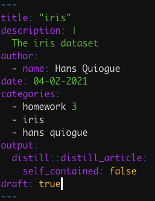
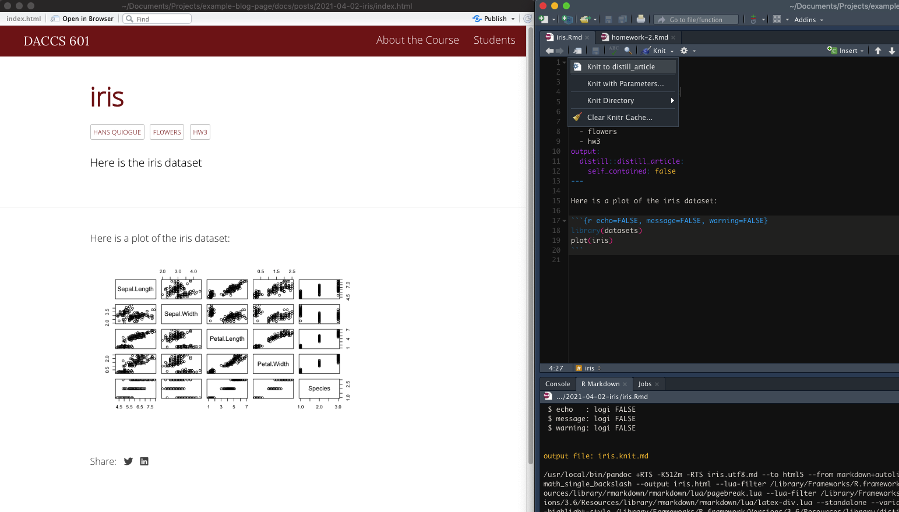
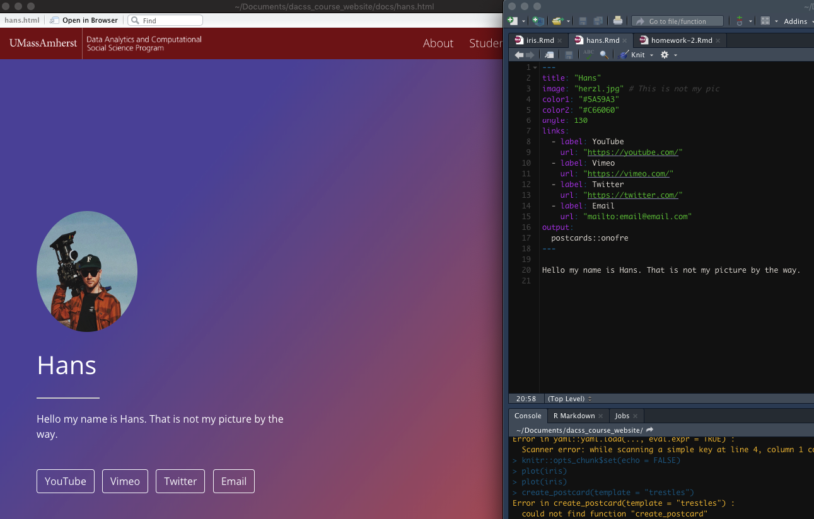
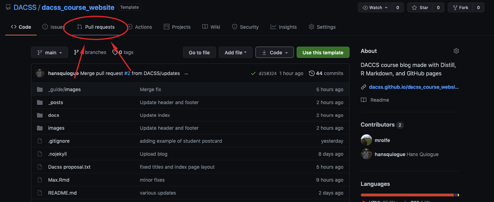
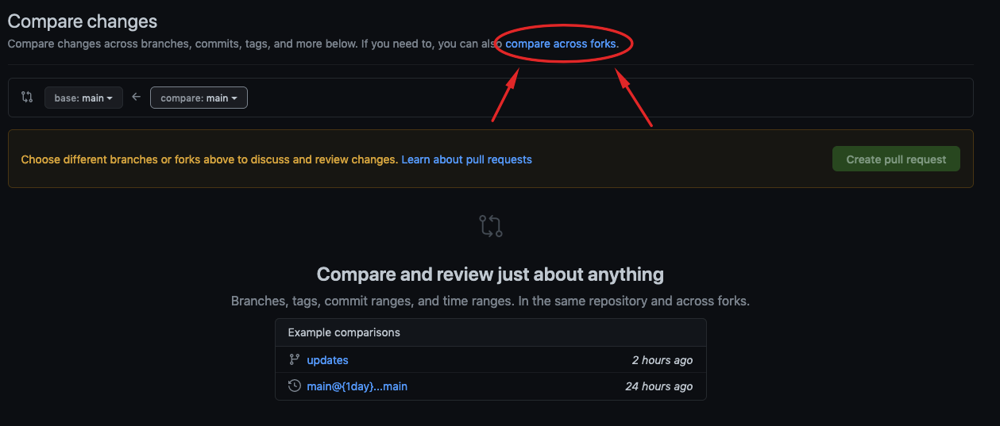
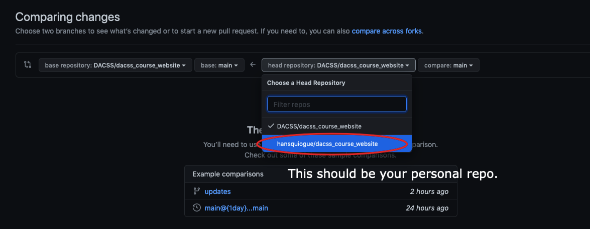
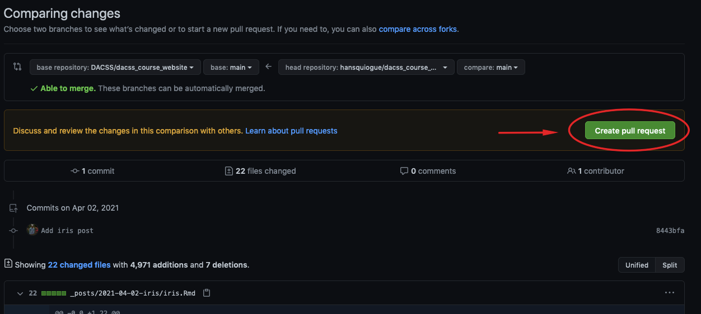

# DACSS Course Blog Template

This is the generic DACSS course blog hosted on GitHub pages. Students will create a templated repository, work in RStudio to create new posts, and then commit and push the changes prior to submitting a pull request to main repository. 

# Prerequisites

Note: this assumes you have setup Git and RStudio and have basic knowledge of how to use Git. Please watch the following [videos](https://youtube.com/playlist?list=PL6fG9co6nK8ebkhWSS11z9MWKzRdoqzoT) or follow a basic Git guide first to set everything up.

# R Package (for Instructors)

You may use [blogbuilder](https://github.com/DACSS/blogbuilder), an R package designed to create and manage DACSS course blogs. Here is the package's [documentation](https://github.com/DACSS/blogbuilder/tree/main/man#readme). Other than the written guide, a video version for instructors and students can be found as well.

# Workflow (for Students)

- [Forking the Repository](https://github.com/DACSS/course_blog_template#forking-the-repository)
- [R Package Requirements](https://github.com/DACSS/course_blog_template#r-package-requirements)
- [Exclude the Docs Folder](https://github.com/DACSS/course_blog_template#r-package-requirements#excluding-the-docs-folder)
- [Create a New Post](https://github.com/DACSS/course_blog_template#creating-a-new-post-with-distill)
- [Create an About Me Page](https://github.com/DACSS/course_blog_template#creating-an-about-me-page-with-postcards)
- [Making a Pull Request](https://github.com/DACSS/course_blog_template#making-a-pull-request-to-the-main-repo)

## Forking the Repository

First you will need to fork the repository. You can do that by clicking the `Fork` icon on the top right corner of the DACCS repo page.



If prompted to choose a user, choose your main GitHub account.

After you have forked the repo, you will have your 'own' version of the repo page to edit; any changes made to this repo will not affect the main DACSS repo. Before heading over to RStudio and making changes, make sure to clone the repo by using the repo HTTP link with a new RStudio project.

## R Package Requirements

You will need to have the `blogbuilder`, `distill` and `postcards` packages first.

- [blogbuilder](https://github.com/DACSS/blogbuilder) can easily manage the course blog as a whole.
- [Distill](https://rstudio.github.io/distill/) will easily allow you to make posts to the blog.
- [Postcards](https://github.com/seankross/postcards) will easily enable you to create a personalized 'About Me' page for the blog.

Make sure you install the packages with `install.packages` like so:

``` r
devtools::install_github('DACSS/blogbuilder')
install.packages('distill')
install.packages('postcards')
```

And load the libraries before proceeding further:

``` r
library(blogbuilder)
library(distill)
library(postcards)
```

## Excluding the Docs Folder

You are required to exclude the docs folder (On the other hand, instructors are required to *include* it). Doing so will avoid Git merge conflicts in the future with other students or the instructor.

You may easily do so with the following command:

``` r
blogbuilder::exclude_docs()
```

## Creating a New Post with Distill

You can create a post by using the `create_post` function from Distill. It takes in [multiple arguments](https://rdrr.io/cran/distill/man/create_post.html), with `title` being required. It is also required to utilize `draft = TRUE`; this ensures that the posts you create does not update the entire site.

For example I can do:

``` r
distill::create_post(title = 'iris', draft = TRUE)
```

The package will easily generate an R Markdown file for you to edit and use as a template for your post. Now, you can edit the file to your liking.

Note: I would recommend updating the header description and add categories:



Categories will be important as the inputted text will be used as labels for posts. This will come aparent later on. 

Once you are done, simply knit the file as a `distill_article`.



You will recieve an output preview of what your post will look like.

Once you are done commit and push your changes to your repo.

## Creating an About Me Page with Postcards

You can create an About Me page by using the `create_postcard` function. If your instructor has already create a page for you, you may skip this step.

Here are [examples](https://github.com/seankross/postcards#the-templates) of themes you can use.

``` r
# Four different themes you can use, only choose one!
postcards::create_postcard(file = 'your_name.Rmd', template = "jolla")
postcards::create_postcard(file = 'your_name.Rmd', template = "jolla-blue")
postcards::create_postcard(file = 'your_name.Rmd', template = "trestles")
postcards::create_postcard(file = 'your_name.Rmd', template = "onofre")
```

Choose one you would like to use. Make sure to update `your_name.Rmd` with your name in the `file` argument of the function.

A file will be generated for your about page. Be sure to edit the page to your liking. You may view what your page looks like by knitting the page as `postcards`.

I would recommend storing your iamges in the `images` folder for consistency.



Like before, once you're done commit and push all the new generated and modified files to your repo.

## Making a Pull Request to the Main Repo

Once you are done with everything, you may submit a pull request to the main repo. Head over the [repo page](https://github.com/DACSS/dacss_course_website) and click the `Pull requests` button.



Then when your on the next page, click the green `New pull request` button. Afterwards, click the blue `compare accross forks` link.



Edit the head repository **to your repo.**



Once you've done that, create a new pull request.



Add some comments on what this pull request does. For example, in mine I added a new post about the iris dataset and created my about me page. Once you're done click the `Create pull request` button.

That's it! Wait for the instructor to review your pull request. They will give you feedback and if they approve your request, all your changes will be reflected on the main repo and website!