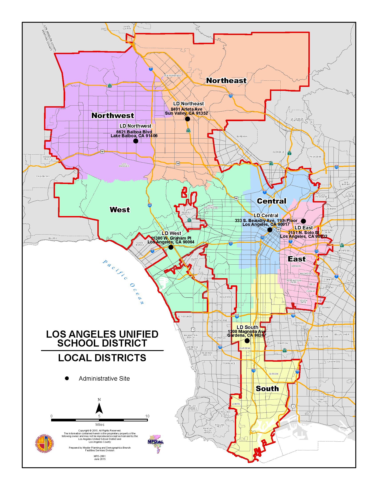

## Homework 3

```{r setup, include=FALSE}
knitr::opts_chunk$set(echo = TRUE)
library(tidyverse)
library(blogbuilder)
library(distill)
library(devtools)
```
```{r}
#Importing dataset
library(readxl)
SENISData <- read_excel("../../_data/SENIScoresElementaryShools-20212022.xlsx")
```
---
**In the SENI dataset I would like to take a look at 4 variables, the Homeless, Foster, and English Learning Counts. The counts are reported by each elementary school in LAUSD. I would like to compare those numbers by local districts that are within the LA Unified School District.**
---

**First I want to create a tibble showing only the columns or variables I want to focus on, Local districts, homeless, foster, EL count and total enrolled. **
```{r, include=TRUE}
#Selecting the variables I will be evaluating and renaming that to tidySENI.
tidySENI <- select(SENISData, c('Local District', 'Homeless Count', 'Foster Count', 'EL Count', 'Total Enroll'))
tidySENI
```

**Checked the variables of interest for missing values and none were found. Good to go.**
```{r}
#Checking for missing values in new tidySENI dataset
tidySENI[!complete.cases(tidySENI),]
```

**Found that there are 6 local districts in LAUSD; South, Central, East, West, Northwest, and Northeast.**
```{r}
#Checking how many local districts there are and their labels
pivot_wider(tidySENI, 'Local District')
```
**Map of LAUSD local districts**

```{r}
#Re-coded Local District values to make them easier to read
tidySENI[,1] <- ifelse(tidySENI[,1]== "S", "SOUTH", ifelse(tidySENI[,1]== "C", "CENTRAL", ifelse(tidySENI[,1]=="W", "WEST", ifelse(tidySENI[,1]=="E", "EAST", ifelse(tidySENI[,1]=="NE", "NORTHEAST", ifelse(tidySENI[,1]=="NW", "NORTHWEST", 99 ))))))
tidySENI
```

**Viewing summary of the tidySENI set I can see the mean/average, minimum and maximum amount of each of the variable counts. So the maximum homeless count is 50 and average is 3.6 or 4, the maximum count of foster is 19 and average is 3.6 or 4 and the max of English Learning counts is 410 and the average is 110. **
```{r}
summary(tidySENI)
```
```{r}
# Viewing how many schools are in each local district
table(tidySENI$`Local District`) 
```
*My next goal on this data is to find a way to combine numbers for each local district. For example if I were to analyse in Excel I can create a pivot table showing how many Homeless, Foster, and English Learners are in each local district and summarize by sum and percentages. Then create a visual to demonstrate findings.*


