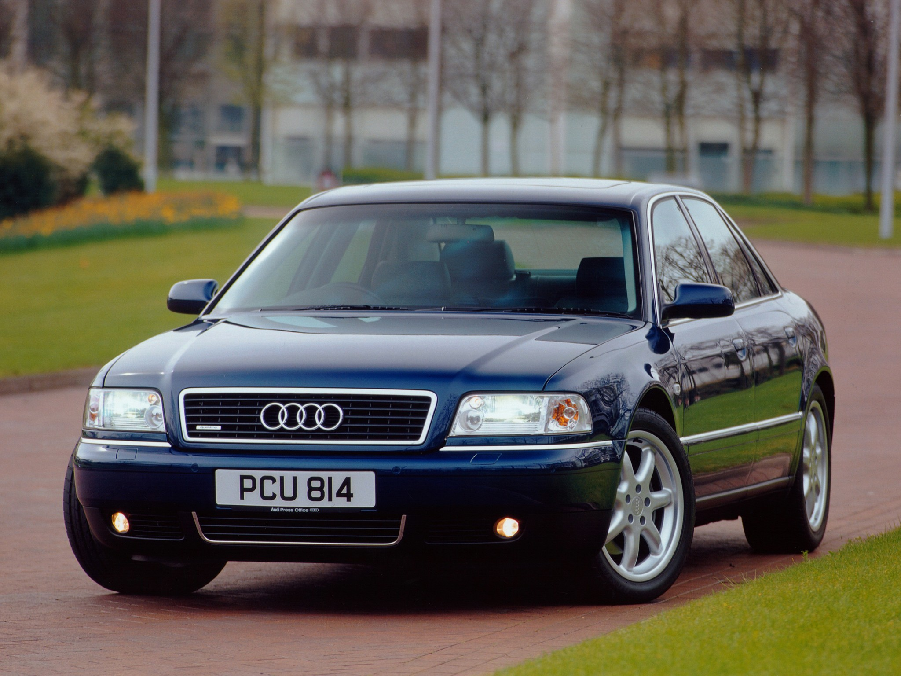

```{r setup, include=FALSE}
myDataPath <- read.csv("../../_data/Car_sales.csv", header=TRUE, stringsAsFactors = FALSE) 
require(tidyverse)
require(tidyr)
require(dplyr)
```

```{r, include=FALSE}
myDataPath <- rename(myDataPath, resale__value = X__year_resale_value)
myDataPath$Vehicle_type <- NULL #deleted the vehicle_type column, was redundant. Only had the option of being a "car" or a "passenger" vehicle--both are synonymous.
myDataPath <- myDataPath[-9,] #deleted the 328i row in order to combine in places and create a 3-Series row.
myDataPath[myDataPath$Sales_in_thousands==19.747,3] <- 28.978 #added the sales from the 328i to the new row
myDataPath[myDataPath$Sales_in_thousands==28.978,4] <- 25.744 #used the mean of the resell value of the 328i and 323i to generate a new resell value
myDataPath[myDataPath$Sales_in_thousands==28.978,2] <- "3-Series" #replaced the model from 328i to 3-Series
myDataPath[myDataPath$Sales_in_thousands==28.978,5] <- 30.195 #used the mean of the price of the 328i and 323i to generate a new price

myDataPath <- myDataPath[-97,] #deleted the SLK230 row in order to combine in places and create an SLK-Series row.
myDataPath[myDataPath$Sales_in_thousands==7.998,3] <- 9.524 #added sales from SLK230 to SLK-Series
myDataPath[myDataPath$Sales_in_thousands==9.524,4] <- 25.581 #used the mean of the resell value of the SLK and the SLK230 to create a resell value for the new SLK Series row
myDataPath[myDataPath$Sales_in_thousands==9.524,2] <- "SLK-Series" #created a new SLK Series row
myDataPath[myDataPath$Sales_in_thousands==9.524,5] <- 39.950 #used the mean of the price of the SLK and the SLK230 to create a new price for the new SLK Series row

myDataPath <- myDataPath[-125,] #deleted the Porsche Carrera Cabriolet row to combine in places and create a 911-Series Row
myDataPath[myDataPath$Sales_in_thousands==1.280,3] <- 3.146 #added sales from the Porsche former Cabriolet row
myDataPath[myDataPath$Sales_in_thousands==3.146,4] <- 64.088 #used the mean of the resell value of the Porsche Carrera and Porsche Carrera Cabriolet to create a new resell price
myDataPath[myDataPath$Sales_in_thousands==3.146,2] <- "911 Series" #created a new 911 series row
myDataPath[myDataPath$Sales_in_thousands==3.146,5] <- 72.995 #used the mean of the price of the Porsche Carrera and Porsche Carrera Cabriolet to create a new price
```

```{r, include=FALSE}
expensive_cars <- filter(myDataPath, `Price_in_thousands` >= 35) #created a data set that only shows expensive cars that cost at least 35,000.
  affordable_cars <- filter(myDataPath, `Price_in_thousands` < 35) #created a data set that only shows inexpensive cars that cost less than 35,000.
```

```{r echo=FALSE, out.width='100%'}

```
                                                                  2000 Audi A8

## The time consuming quest to find which year the data was compiled during:

The most crucial part of tidying my data was to address the NA values. However, before I could begin inputting NA values, I had two major issues.

* I was not sure which years were used to compile this data.
* I was also not sure whether this data was compiled using multiple years or one single year.

I chose to begin my search using carsalesbase.com. This website includes worldwide sales for virtually every year after 1990. I first hypothesized the data was conducted in 2012, indicated by the “latest_launch” column. In order to find the year used to report total sales, I first tried investigating American cars where worldwide sales would be fairly negligible (as American cars do not sell well worldwide, the vast majority are bought in America).

For 2008 in the US, Dodge Viper sales were 1.172 (in thousands).
For 2007 (the latest data available for Dodge Viper sales), the sales were 103.
——>The closest number based on the data entered on the initial data set with relation to car sales was in 2008.

However, 2008 seemed improbable as the data frame includes the Chevrolet Camero which was not produced between 2005-2008. I also found the number of Chevrolet Camaro sales was considerably lower than virtually any sales for the model in recent history (which did not make much sense).

I also noticed the Chrysler Cirrus (included on this data set) was only produced from June 1994-2000. The “latest_launch” variable claims the latest launch of this model was 10/6/2011, which is clearly not true.
—>The closest year for the Chrysler Cirrus entry was in 1999.

Audi A8 sales in 1999 were higher in the US sales recorded in the data set by over 1,000 units (which is considerable given that not many units of the Audi A8 are sold in general). Therefore, this led me to believe the data entered for this set was not conducted based on one particular year alone.

The closest amount in sales for the Chevrolet Corvette was in 1996. Therefore, I now began to think the sales figure was entered across a range of years as opposed to one particular year. 

While attempting to input market price information for the BMW 3 Series, I finally found the year the data set was compiled during. I found it by using an obscure model in my data set (which was deleted and compiled into a "3 Series" row but temporarily resurrected for research purposes): the BMW 323i. The last year of production for the BMW 323i occurred in year 2000. Additionally, the last year of production for the Chrysler Cirrus was also in year 2000. Therefore, I hypothesized the data for this set was derived from year 2000. At this juncture, I searched MSRP values for year 2000 across various car databases and finally found that "Price_in_thousands" was generated using the lower end estimate from cars.com. At this point, I was certain that **the price for each car was calculated using data for year 2000**.

Sources:
(https://www.cars.com/research/bmw-323/)

(https://carsalesbase.com/)

## The task of finding a way to implment all the missing NA values for the "resale value" column

Though I had found the year used for sale price was 2000, I still needed to find the year used for the resale price. However, this information was impossible to find. In my experience, it was not possible to find the approximate resale value for a specific car during a specific year. Therefore, I decided to approximate each the resale values myself using an equation I created. 

NA (for resale value) = 
Sales_in_thousands - (price_in_thousands - resale__price)/(number of other models)
                              ^^^
                      remember that you repeat this step for as many models made by the                                manufacturer that don't include the model with the NA value and add the sum                      together. This sum is then divided by however many other models there are                         that do not include the NA value. This figure is then subtracted from the                        original market price of the car.
                      
During Office Hours, I was informed about the possibility of using Multiple Imputation to seamlessly approximate all of my missing values for "resale value." However, I had a great deal of trouble attempting to access the mice function (which is a crucial part of Multiple Imputation). Therefore, I chose to enter the missing values by hand using the equation I generated. 

It is also important to note that several manufacturers had the resale values missing for every model making my equation redundant and the task of approximation very difficult (as I have no other models to base my resell assumptions off of). Therefore, I am choosing to leave these values as NA having no way to accurately and numerically calculate the resell value.


```{r}
myDataPath[myDataPath$Sales_in_thousands==14.785,4] <- 30.858
#changed resell value of Cadillac Escalade

myDataPath[myDataPath$Sales_in_thousands==14.114,5] <- 23.100
#added price for the Acura CL, used year 1999 because the Acura Cl was not made in year 2000 (hence why it was missing in the first place) via Cars.com

myDataPath[myDataPath$Sales_in_thousands==107.995,4] <- 11.956
#added resell value of Chevrolet Impala

myDataPath[myDataPath$Sales_in_thousands==30.696,4] <- 8.072
#added resell value of Chrysler 300M

myDataPath[myDataPath$Sales_in_thousands==101.323,4] <- 19.349
#added resell value of Dodge Durango

myDataPath[myDataPath$Sales_in_thousands==175.670,4] <- 3.334
#added resell value of Ford Focus

myDataPath[myDataPath$Sales_in_thousands==15.467,4] <- 33.000
#Estimated Jaguar with a rather low resale keeping in mind that Jaguar models have some of the worst resale of any car in 2019. Overall, Jaguars are well known to depreciate very quickly. With no other models to compare to and use my equation on, I had to eyeball the Jaguar resale price. 

myDataPath[myDataPath$Sales_in_thousands==15.467,2] <- "S-Type"
#Re-added the model name for the Jaguar because I accidentally deleted it.

myDataPath[myDataPath$Sales_in_thousands==3.334,4] <- 38.342
#added resell value of Lexus GS400
myDataPath[myDataPath$Sales_in_thousands==9.126,4] <- 52.142
#added resell value of Lexus LS470
myDataPath[myDataPath$Sales_in_thousands==51.238,4] <- 26.642
#added resell value of Lexus RX300

myDataPath[myDataPath$Sales_in_thousands==22.925,4] <- 20.080
#added resale value of Lincoln Navigator

myDataPath[myDataPath$Sales_in_thousands==11.592,4] <- 27.231
#added resale value of Mercedes CLK Coupe
myDataPath[myDataPath$Sales_in_thousands==0.954,4] <- 71.131
#added resale value of Mercedes CL500
myDataPath[myDataPath$Sales_in_thousands==28.976,4] <- 20.931
#added resale of Mercedes M-Class

myDataPath[myDataPath$Sales_in_thousands==54.158,4] <- 13.244
#added resale of Nissan Xterra
myDataPath[myDataPath$Sales_in_thousands==65.005,4] <- 8.335
#added resale of Nissan Frontier

myDataPath[myDataPath$Sales_in_thousands==38.554,4] <- 11.444
#added resale of Oldsmobile Intrigue
myDataPath[myDataPath$Sales_in_thousands==80.255,4] <- 5.564
#added resale of Oldsmobile Alero

myDataPath[myDataPath$Sales_in_thousands==1.872,4] <- 37.002
#added resale of Plymouth Prowler

myDataPath[myDataPath$Sales_in_thousands==39.572,4] <- 17.046
#added resale of Pontiac Montana

myDataPath[myDataPath$Sales_in_thousands==8.472,4] <- 16.525
#added resale of Saturn LW
myDataPath[myDataPath$Sales_in_thousands==49.989,4] <- 12.700
#added resale of Saturn LS

myDataPath[myDataPath$Sales_in_thousands==65.119,4] <- 18.858
#added resale of Toyota Sienna

myDataPath[myDataPath$Sales_in_thousands==53.480,5] <- 26.800
#added price for the Chrysler Town & Country via Cars.com
myDataPath[myDataPath$Sales_in_thousands==53.480,6] <- 3.3
#added the engine size for the Chrysler Town & Country via Edmunds.com.
myDataPath[myDataPath$Sales_in_thousands==53.480,7] <- 158
#added the horse power for the Chrysler Town & Country via Edmunds.com.
myDataPath[myDataPath$Sales_in_thousands==53.480,8] <- 119.3
#added the wheelbase for the Chrysler Town & Country via Edmunds.com
myDataPath[myDataPath$Sales_in_thousands==53.480,9] <- 76.8
#added the width for the Chrysler Town & Country via Edmunds.com
myDataPath[myDataPath$Sales_in_thousands==53.480,10] <- 199.7
#added the length for the Chrysler Town & Country via Edmunds.com
myDataPath[myDataPath$Sales_in_thousands==53.480,11] <- 4.045
#added the curb weight for the Chrysler Town & Country via Edmunds.com
myDataPath[myDataPath$Sales_in_thousands==53.480,12] <- 20.0
#added the fuel capacity for the Chrysler Town & Country via Edmunds.com
myDataPath[myDataPath$Sales_in_thousands==53.480,13] <- 18.0
#added the fuel efficiency for the Chrysler Town & Country via Edmunds.com

myDataPath[myDataPath$Model=="Seville",11] <- 3.970
#added the curb weight for the Cadillac Seville via Edmunds.com

myDataPath[myDataPath$Price_in_thousands==22.505,13] <- 28.0
#added the fuel efficiency for the Dodge Intrepid via Edmunds.com

myDataPath[myDataPath$Curb_weight==3.455 & myDataPath$Length==195.9,13] <- 20.0
#added the fuel efficiency for the Oldsmobile Intrigue via Edmunds.com
```

```{r}
ggplot(myDataPath,
  aes(x = Sales_in_thousands, y = resale__value/Price_in_thousands)) +
  coord_cartesian(xlim = c(0, 400), ylim = c(0, 1)) +
  geom_point(size = 0.5) +
  geom_line(colour = "green") +
  geom_smooth() +
  facet_wrap(~Manufacturer) +
  labs(title = "Price Retention Across Manufacturers vs. Sales",
       x = "Sales(in thousands)",
       y = "Price Retention")+
  theme_dark()
```
Ultimately, I wish to compare how much value cars hold across all manufacturers. To do this, I created a visualization that compares the sales to what I will call the "price retention" given by (resale price/price). The "price retention" outputs a ration that can be used to compare how much value each car maintains in relation to one another.

I hypothesized Porsche would have the highest resale value of any manufacturer in the data set. I have a friend that knows a great deal about car resale prices and he once told me Porsches hold their value the best of any car on the market. Therefore, Porsches can sometimes be investments that quadruple in value due to their efficiency and cult following.

As the visualization indicates, though Porsche does not sell anywhere near as many units as the likes of Ford or Toyota, the price retention of Porsches is the very best. Other German contemporaries like BMW and Mercedes-Benz also have high price retention ratios. Contrastingly, the price retention for American manufacturers like Oldsmobile, Pontiac, Mercury, and Lincoln are among the very worst. I hope to find in my research why this is.

```{r}
myDataPath <- mutate(myDataPath, "Price_Retention" = resale__value/Price_in_thousands)
```

```{r}
ggplot(myDataPath,
  aes(x = Horsepower, y = Price_Retention)) +
  geom_line(color = "black") +
  geom_smooth(color = "blue") +
  geom_vline(aes(xintercept = mean(Horsepower/Price_Retention, na.rm = TRUE), color = 'mean'), show.legend = TRUE, size = 2) +
  geom_vline(aes(xintercept = median(Horsepower/Price_Retention, na.rm = TRUE), color = 'median'), show.legend = TRUE, size = 2) +
  labs(title = "Price Retention vs. Horsepower",
       x = "Horsepower",
       y = "Price Retention") +
  theme_classic()
```

Overall, the following data tells us several things. For one, **a correlation does exist between price retention and horsepower.** There is essentially an ideal band where price retention is particularly high for cars under around 165 horsepower. Similarly, another band exists before the mean and median where the price retention increases as the horsepower increases (at around 265 horsepower). Cars that fall in between these two "hot spots" suffer from having the lowest Price Retention overall. 

As we can already deduce, Horsepower is obviously strongly correlated to price. Typically, the more expensive a car is, the more horsepower it tends to have. Next, we will look at the price retention versus the initial price of the car. The correlation between horsepower and price retention indicates that there must also be "hot spot" in initial cost versus price retention.

```{r}
ggplot(myDataPath,
  aes(x = Price_in_thousands, y = Price_Retention)) +
  geom_line(color = "black") +
  geom_smooth(color = "dark red") +
  geom_vline(aes(xintercept = mean(Price_in_thousands/Price_Retention, na.rm = TRUE), color = 'mean'), show.legend = TRUE, size = 2) +
  geom_vline(aes(xintercept = median(Price_in_thousands/Price_Retention, na.rm = TRUE), color = 'median'), show.legend = TRUE, size = 2) +
  labs(title = "Price Retention vs. Initial Cost",
       x = "Initial Cost(in thousands)",
       y = "Price Retention") +
  theme_classic()
```

Indeed! There is a certain sweet spot regarding Price Retention versus the initial price of the car. Essentially, cars that are less that about 20k exist in the "hot spot" regarding price retention for the inexpensive car market. Cars over around 37k exist in a "hot spot" where the higher the initial cost of the car is, the more it will resell for.

At this point, we now have to try and investigate the cars with the lowest price retention to see if their low price retention occurs due to failing to exist in the sweet spots of the Price and Horsepower variables.
